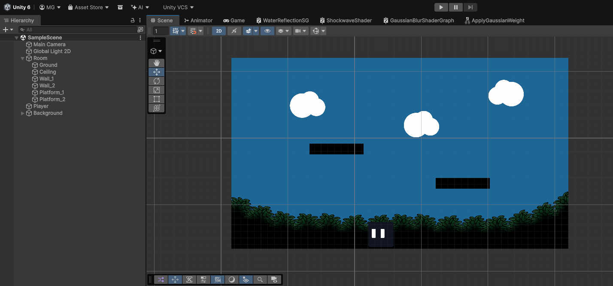
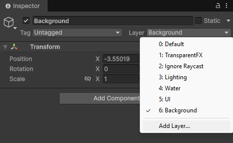
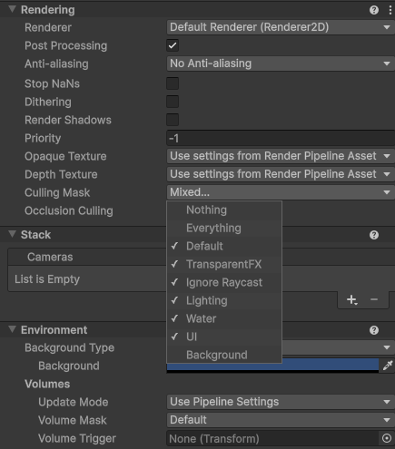
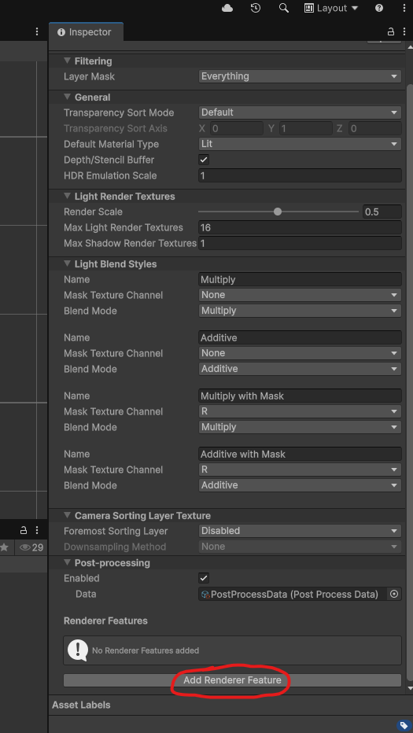
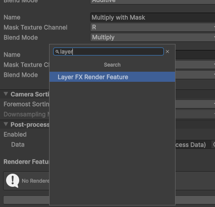
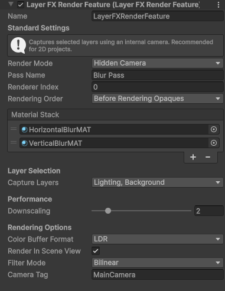
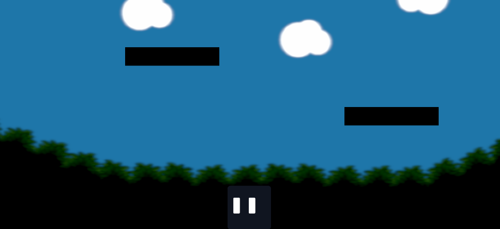

# **LayerFX Render Feature Setup**
### (5 minutes)

Setting up your own custom render pass is simple. Follow these steps to get started!

# 1. Scene Setup

We'll start off with a simple scene in the editor. The player sprite is very dark against the background, so in this guide, we'll set up a blur pass on the background to make the player pop.

This scene contains the default Unity Main Camera, as well as a Global Light 2D. There is also the player game object, some walls and platforms, and the background sprites.

- Firstly, we should switch the background sprites to a separate layer. Select the parent game object, click on the layer dropdown, and change it to the desired layer. 
Here, we added a layer called 'Background'. 

**Note:** If your background is organized under a parent object, choose 'Yes, Change Children' so every child object is moved to the new layer.

- Also change your GlobalLight2D to a separate layer, so we can capture it in the render pass. Here, we created a layer called 'Lighting'. 

- You will also want to deselect your desired layers from the Main Camera's culling mask. This prevents the desired layers from rendering twice (both on the Main Camera and from the Render Feature). 

- Here, we deselected the 'Background' mask, but kept the 'Lighting' mask enabled because we want the lights to affect both the blurred layers and the main layers.

# 2. Renderer2D Setup

Now we need to configure the render feature on the renderer. 

## Locating the Renderer2D asset

Locate your project's Renderer2D asset.

If you can't find it, first find your Universal Render Pipeline asset. This can be found by going to Edit > Project Settings > Quality > Render Pipeline Asset.
Once you have located your Universal asset, you can find your 2D Renderer in the Renderer list at the top of the Inspector window.

## Adding the Render Feature

Scroll to the bottom of the Inspector window of your Renderer2D asset, and click 'Add Render Feature'.

Select **'Layer FX Render Feature'.**

## Configuring the Render Feature

Now we must configure the settings of the render feature.

- **Render Mode:** This determines **how** LayerFX will render. Here, we will 
select **Hidden Camera**, because this mode is recommended for most projects and
will allow us to isolate the blur to only the background layers.
- **Pass Name:** Set to whatever you want. This internally names the render pass for debugging purposes. Here we'll name it 'BackgroundBlurPass'.
- **Renderer Index:** This selects what renderer the render feature should render on. To see the list of available renderers, look at the Renderer List field in your Universal Renderer asset. 
For most cases, you can leave this field set to 0. For this guide, we can leave it
at 0.
- **Rendering Order:** This determines at what point during the rendering process the feature will render at. For most 2D projects, you can
select **BeforeRenderingOpaques** to render behind the main scene layers, or
**AfterRenderTransparents** to render on top of the main scene. As we are trying to blur the background, we will set it to **BeforeRenderingOpaques**.
- **Material Stack:** Select 1 or more materials to render the desired layers with. Selecting more than one material will stack the materials in the listed order.
This allows users to combine multiple effects, or make multi-pass effects. In this tutorial, we are creating a 2-pass blur to save performance.
We will add two blur materials, one that blurs horizontally and one that blurs vertically. 
These materials used in this guide can be found in the LayerFX package at 
**Assets/LayerFX/Samples/Materials/ShaderGraph/Gaussian Blur/**.
- **Capture Layers:** This is where we select the layers that the effect should be applied to. Here we will select the 'Background' and 'Lighting' layers.
- **Downscaling:** Downscales the texture to save performance. In this guide, we will select 2x, because there will be minimal visual impact due to blurring the layers.
- **Color Buffer Format:** This determines whether the render feature will render with an HDR
format or an LDR format. For this guide, we will select LDR.
- **Render In Scene View**: Enable this to render the effect in scene view.
- **Filter Mode:** Determines how to filter the render feature texture. For this guide, we will set
it to Bilinear.
- **Camera Tag**: When using the Hidden Camera rendering mode, the internal camera will sync to
a selected camera. We want the internal camera synced to the main scene camera, so we will leave the
camera tag set to "MainCamera". Ensure your main scene camera has a matching tag.

These are the final configured settings we used in this tutorial:

Now press Play and watch the effect! Our blur effect turned out really well, and now the player is much more visible against the noisy background. 

## Troubleshooting

If the LayerFX render feature is not working as intended after completing
the setup instructions, double check the following:

 - **Nothing renders**:

Ensure the LayerFX render feature is attached to an active renderer asset. 
Double-check that the renderer is added to your URP asset's Renderer List.

- **Selected layers rendering in black:**

Ensure that a layer with URP lighting is selected in the **Capture Layers** field
on the LayerFX render feature.

Alternatively, ensure that the original sprites are rendering with an Unlit material.

- **Hidden Camera mode not rendering anything:**

Make sure that the Camera Tag field contains a tag that exactly matches your main camera's tag.

 - **Layers rendering twice:**

Deselect the layers from your main scene camera's culling mask. If the layers are rendering twice
in Scene View, deselect the layers from your Scene View culling mask.

If you are using the Renderer List render mode, layers rendering twice is somewhat unavoidable
and is a known limitation for that mode.