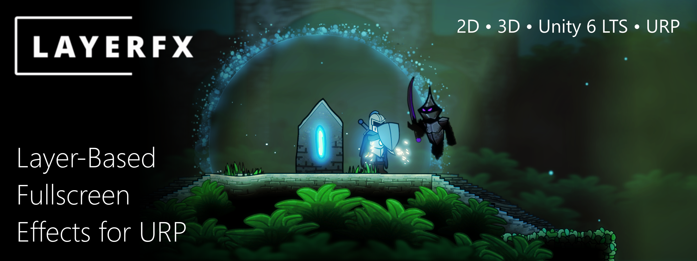
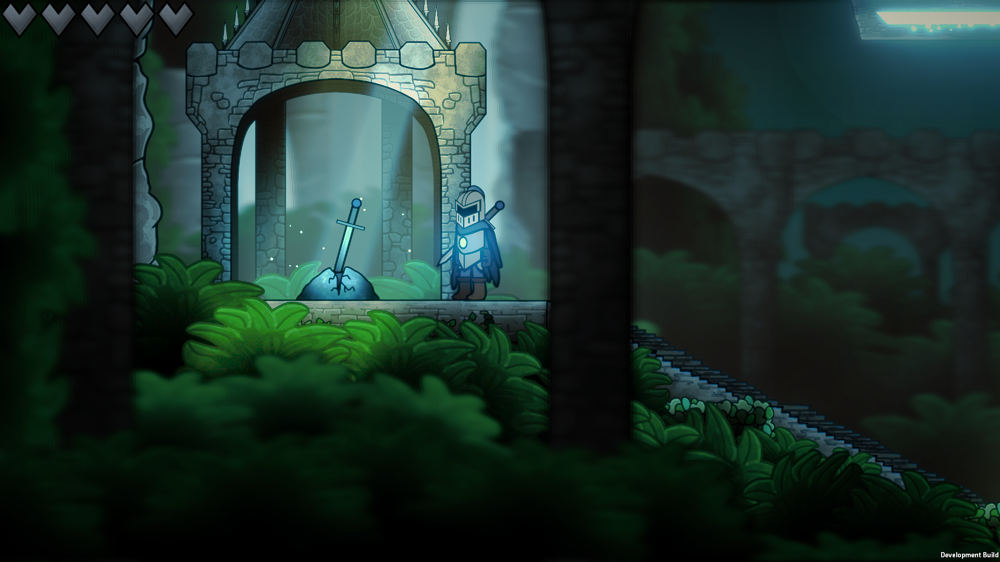
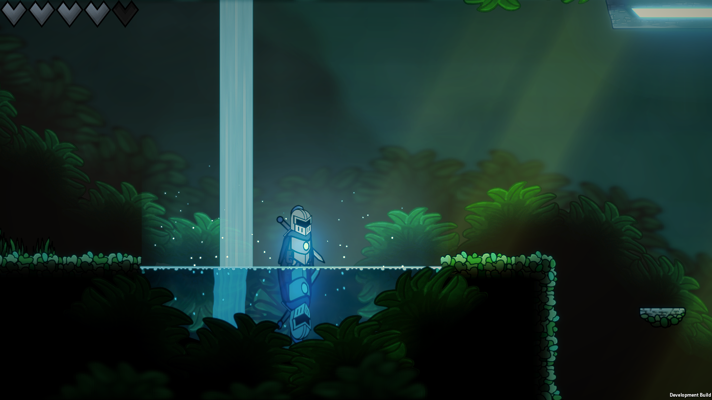
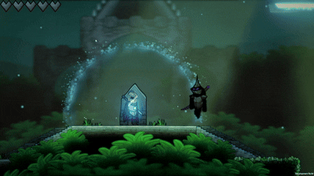

# LayerFX Offline Documentation

**Start here if you are viewing the documentation from inside the Unity package.**

For the best browsing experience, online documentation is available at:
https://myth0-games.github.io/LayerFXDocs

---

# LayerFX: Layer-Based Fullscreen Effects for URP

Create powerful fullscreen effects in URP with precise control over what gets rendered. Apply blur, 
distortion, shockwaves, reflections, and custom shader effects to exactly the layers you choose.

Select a layer mask, add one or more materials, and LayerFX will 
automatically apply your effects to the selected content.

## Quick Navigation

- **[Quick Start Guide](quick-start-guide.md)** — Set up LayerFX in a new project.
- **[Usage Examples](usage-examples.md)** — See common production workflows.
- **[API Reference](api-reference.md)** — Detailed field and setting reference.
- **[Custom Shaders and Materials](custom-shaders-and-materials.md)** — Create your own fullscreen effects.
- **[FAQ and Troubleshooting](faq-and-troubleshooting.md)** — Fix common setup issues.

## See LayerFX in Action

**Selective Blur**

**Water Distortion and Reflections**

**Dynamic Shockwaves**

## Watch the Trailer

You can watch the LayerFX trailer here:

https://www.youtube.com/watch?v=Q5fk6dURLC4

## Why LayerFX?

Traditional post-processing workflows typically affect the entire camera output.
LayerFX gives you precise control over what receives effects.

Create:

- Background-only blur
- Player-only distortion
- Selective bloom
- Custom shockwaves
- Reflection effects
- Multi-pass shader effects

## Capabilities

### Fast Setup, Powerful Results

LayerFX is simple to set up and only takes a few minutes to configure. It was designed with 
ease-of-use in mind. Simply select your layer mask or input texture, and add your materials!

### Multiple Workflows

LayerFX offers 3 different workflows depending on your project's needs. 

**Hidden Camera:** Render your effects through an efficient internal camera that LayerFX will
automatically configure. This mode fully supports URP lighting, shadows, and post-processing.

**External Texture Workflow:** Input a custom Render Texture and let LayerFX process it with
your selected materials before compositing it back onto the screen.

**Renderer List:** A more efficient pipeline for projects that do not require
URP lighting, shadows, and post-processing.

### Combine Multiple Effects

LayerFX supports material stacking, 
allowing you to combine multiple shader effects into powerful multi-pass rendering chains.

### Custom Material Support

Custom materials are fully supported with LayerFX, allowing you to create your own shader 
workflows.
Visit the [Custom Materials Page](custom-shaders-and-materials.md) to learn more about material
requirements.

### Efficient Rendering

LayerFX is designed to be lightweight, with performance depending on 
material complexity, resolution, and the amount of content being processed. 
You can learn more about performance benchmarks and testing [here](performance.md).

### Compatibility

LayerFX is compatible with most Unity 6 LTS versions.

It is designed for the URP pipeline.

While LayerFX was designed with 2D projects in mind, it is also capable of rendering fullscreen
effects in 3D projects.

You can learn more about version support [here](version-support.md).

## What's Included

LayerFX comes with its main runtime and editor scripts, as well as a wide variety of sample
content, including:

 - A demo scene demonstrating LayerFX's capabilities.
 - 6 ready-to-use Shader Graph effects, including blur, distortion, shockwave, and more.
 - 1 HLSL example shader.
 - A preconfigured 2D Renderer, set up with LayerFX.

Visit the [Contents Page](contents.md) to learn more about the included content, as well as the
folder structure and where to find each item.

## Getting Started

Explore some of the [Usage Examples](usage-examples.md) to see LayerFX in action.

Visit the [Quick Start Guide](quick-start-guide.md) to begin setting up LayerFX in your project.

Visit the [API Reference Page](api-reference.md) to learn more about the different settings and
variables that can be used to configure your effects.

## Contact the Developer

For support, queries, or bug reports, you can contact the developer at myth07games@gmail.com.

For bug reports, please include your Unity version, URP version, and a description of the issue.