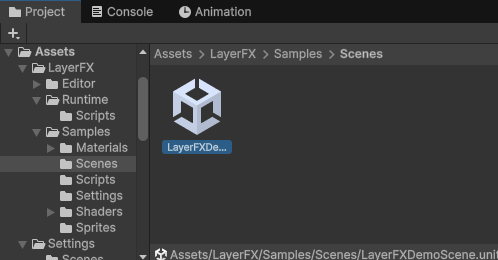
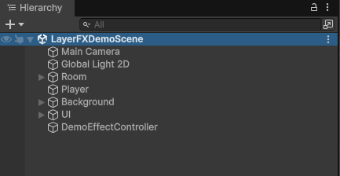
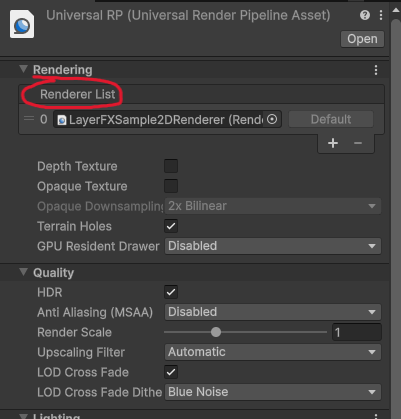
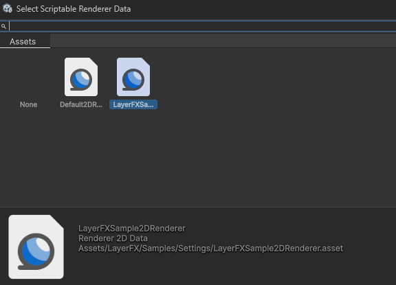

# Quick Start Guide
### (2 Minutes)

This guide will cover everything you need to know when importing LayerFX for the
first time, including how to view and set up the included demo scene.

## Package Structure

Please visit the [Package Contents Page](https://myth0-games.github.io/LayerFXDocs/contents/)
to familiarlize yourself with the package folder structure and what files may be 
safely removed from your project.

## Setting Up the Demo Scene

To properly view LayerFX in action through the demo scene, an extra setup step is
required. Follow these steps to get started!

1. Navigate in the Project Window to **Assets/LayerFX/Samples/Scenes/**.

2. Drag the **LayerFXDemoScene** into the Hierarchy window. For best results,
temporarily remove other scenes from the Hierarchy window.

3. To properly view the LayerFX demo scene in action, the LayerFX sample renderer 
must be attached to your project's URP asset. To find your URP asset, go to
**Edit > Project Settings > Quality > Render Pipeline Asset** and click on the
URP asset.

4. Once you have located your project's active URP asset, find the **Renderer List**
field under the **Rendering** dropdown.

5. Add another renderer to the Renderer List field. Select the
**LayerFXSample2DRenderer**. Set this to the default renderer.

6. The demo scene is now ready. Press Play and use the Previous/Next buttons
to cycle through the included effects.

The included sample renderer is preconfigured with LayerFX so you can try the
demo scene immediately. Your own project does not need to use this renderer.

For detailed instructions on configuring your own renderer with LayerFX, please 
visit the [Custom Render Pass Setup Page.](https://myth0-games.github.io/LayerFXDocs/custom-render-pass-setup/)
