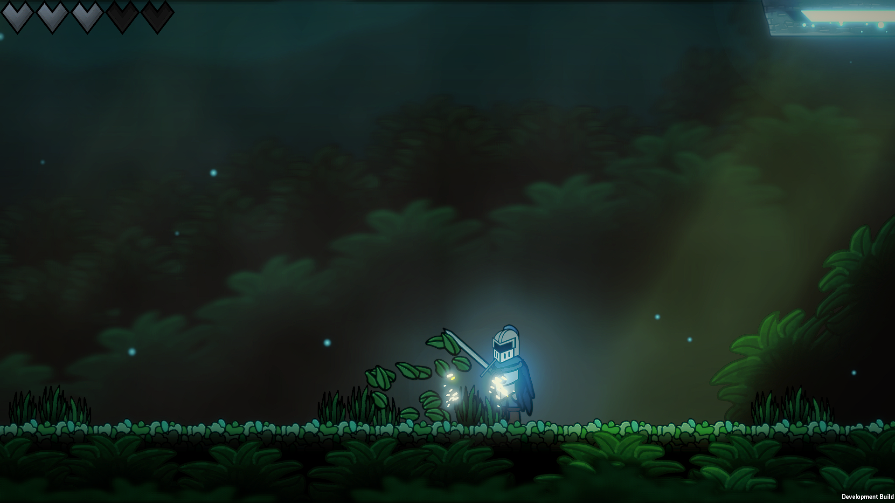
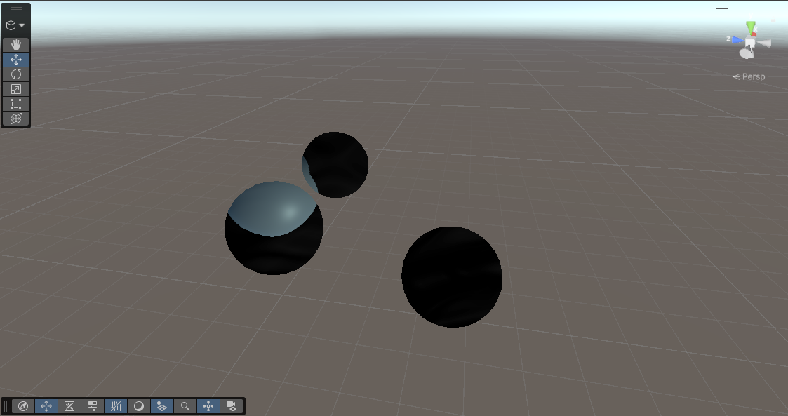

# Usage Examples

This page features examples of how LayerFX can be used to create a variety of beautiful effects 
in production-ready projects. 

These effects can be made by combining different material stacks, 
render modes, and layer content within a scene.

## Quick legend

- **Hidden Camera:** Isolates selected layers while preserving URP lighting and post-processing.
- **Renderer List:** Renders selected layers through the fastest path, but with additional 
limitations.
- **From External Texture:** Renders a camera to a Render Texture and imports that texture 
into LayerFX.

## Isolated Blur


Blur the foreground and background while keeping gameplay elements perfectly sharp. This is 
difficult to do with URP depth-of-field, especially in 2D projects where there is no real depth.

### Setup

Recommended Rendering Mode: **Hidden Camera**

**Alternative:** Renderer List (when lighting and shadows are not required)

1. Add one, two, or more LayerFX Render Features to your 2D Renderer. 
2. Set each Render Feature to the **Hidden Camera** rendering mode.
3. On each render feature, select a subset of layers.
For example, select your foreground layers on one render feature and your background layers 
on another. 
4. Add any [valid material](custom-shaders-and-materials.md) to the render features. 
For isolated blur, select a blur material.
If you are using the included Gaussian blur shader, add two materials to the stack:
the Horizontal Blur Pass material **and** the Vertical Blur Pass material.

This effect can make your scene much more readable, and give it a softer look.

The possibilities also extend far beyond blur. The same isolation technique can be used for 
distortion, outlines, cinematic 
color effects, shockwaves, and other custom fullscreen shader workflows.

## Isolated Post-Processing



LayerFX can be used to isolate URP post-processing effects.

This is one of LayerFX's most powerful workflows because it allows built-in URP post-processing to 
affect only selected layers instead of the entire screen.

The above image demonstrates an isolated Bloom effect on the player's energy bar and the 
spark particles. Isolating URP post-processing can also create effects such as selective 
depth-of-field, selective color grading, and more.

### Setup

Recommended Rendering Mode: **From External Texture**

1. Add a LayerFX Render Feature to the 2D Renderer and select the **From External Texture**
rendering mode. 
2. Create a secondary camera in your scene, rendering to a custom Render Texture.
3. Input this texture into the **Texture** field on the LayerFX Render Feature.
4. On the camera, set the Volume Mask to contain a layer with
a post-processing volume containing your desired effects. 

LayerFX will then blit the texture to the screen, making selective post-processing simple.

This method can also be combined with the LayerFX material stacking feature, allowing you to
easily combine URP post-processing with custom materials.

## Water Distortion and Reflections


LayerFX can be used to create beautiful 2D water, with effects like distortion and reflection.

### Setup

Recommended Rendering Mode: **From External Texture**

1. Add a LayerFX Render Feature to the 2D Renderer using the **From External Texture**
rendering mode.
2. Create an additional scene camera that renders your player and other sprites you
want reflected.
3. Set the output of this camera to a Render Texture and input the texture to the
LayerFX Render Feature.
4. Use the LayerFX material stack to apply water materials, such as distortion, refraction, 
and vertically flipping the sampled texture within the shader to create reflections.

## Shockwaves


LayerFX can be used to create dynamic effects such as fullscreen shockwaves. Effects can be
animated through code, using Coroutines, Update loops, or function triggers from the Animation
Timeline.

### Setup

Recommended Rendering Mode: **Hidden Camera**

1. Add a LayerFX Render Feature to your 2D Renderer using the **Hidden Camera** rendering mode.
2. Select the layers you want the shockwave to distort. 
3. Use the LayerFX Material field to apply the included shockwave sample material 
or your own custom shader. 
4. Use code to animate the material to create dynamic shockwaves or other effects.

The following code is an example Coroutine used to animate the included shockwave material.

```
    private IEnumerator ShockwaveCoroutine()
    {
        float distanceFromCenter = -0.1f;

        while (distanceFromCenter < 1f)
        {
            distanceFromCenter += Time.deltaTime * speed;

            /* _WaveDistanceFromCenter controls how far from the center of the shockwave
            the distortion ring appears in the included shockwave material. */
            shockwaveMaterial.SetFloat("_WaveDistanceFromCenter", distanceFromCenter);

            yield return null;
        }
    }
```

## 3D Effects



While LayerFX is primarily designed with 2D projects in mind, the versatile nature of Render Graph
allows it to be compatible with 3D projects as well.

Simple 3D effects are easy to create with LayerFX. Fullscreen shockwaves, blur, distortion, 
and other fullscreen material effects are compatible with 3D projects, 
though visual quality may vary depending on the scene setup.

**LayerFX is officially supported for URP projects.** The 3D examples are provided as 
compatibility demonstrations rather than dedicated 3D workflows.